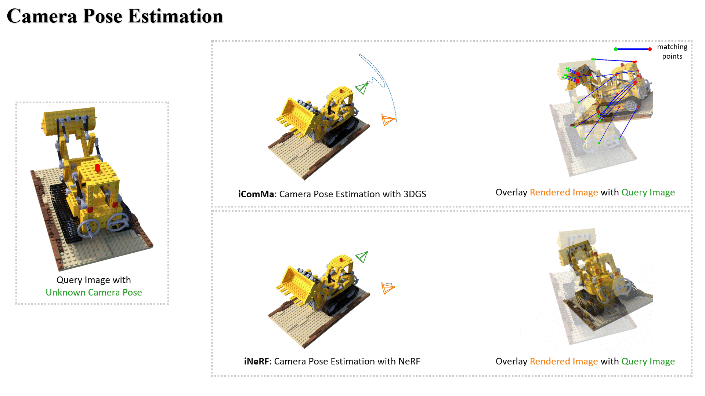
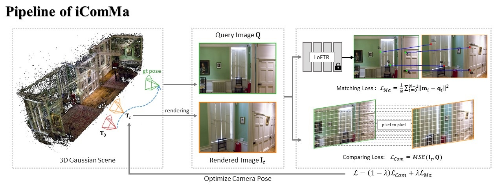

# iComMa: Inverting 3D Gaussian Splatting for Camera Pose Estimation via Comparing and Matching

 <a href='https://arxiv.org/pdf/2312.09031.pdf'></a> &nbsp; <a href='https://yuansun-xjtu.github.io/iComMa.io/'></a>

<div align="center">
    <a target='_blank'>Yuan Sun <sup>1</sup> </a>&emsp;
    <a href='https://xuanwangvc.github.io/' target='_blank'>Xuan Wang <sup>2</sup></a>&emsp;
    <a target='_blank'>Yunfan Zhang <sup>1</sup> </a>&emsp;
    <a target='_blank'>Jie Zhang <sup>1</sup> </a>&emsp;
    <a href='https://caiguijiang.github.io/' target='_blank'>Caigui Jiang <sup>1</sup> </a>&emsp;</br>
    <a href='https://yuguo-xjtu.github.io/' target='_blank'>Yu Guo<sup>1</sup> </a>&emsp;
    <a target='_blank'>Fei Wang <sup>1</sup> </a>&emsp;
</div>
<br>
<div align="center">
    <sup>1</sup> Xi'an Jiaotong University &emsp; <sup>2</sup>  Ant Group  &emsp;
</div>

## Overview





## Installation
Create environment through conda:
```
conda create -n icomma python=3.10
conda activate icomma
```
Install PyTorch compatible with the CUDA version:
My CUDA version is 11.7, and the PyTorch version is 1.13.1.
```
pip install torch==1.13.1+cu117 torchvision==0.14.1+cu117 torchaudio==0.13.1 --extra-index-url https://download.pytorch.org/whl/cu117
```
Clone the repository and install dependencies:
```
git clone https://github.com/YuanSun-XJTU/iComMa.git
cd iComMa
pip install -r requirements.txt
```
## Tutorial
**1. Download the pre-trained LoFTR model.**
Download the <a href='https://drive.google.com/drive/folders/1xu2Pq6mZT5hmFgiYMBT9Zt8h1yO-3SIp' target='_blank'>LoFTR</a> model to the path: ```LoFTR/ckpt```.
```
├── LoFTR 
│   ├── ckpt   
│       ├── indoor_ds_new.ckpt
│       ├── indoor_ot.ckpt
│       ├── outdoor_ds.ckpt
│       ├── outdoor_ot.ckpt
```
Compared to the raw LoFTR code, we have modified the files `LoFTR\src\loftr\utils\coarse_matching.py` and `LoFTR\src\loftr\utils\fine_matching.py` to ensure gradient backpropagation.

**2. Prepare data and train the 3DGS model.**
We evaluated our method using the Blender, LLFF, and 360° Scene datasets provided by  <a href='https://www.matthewtancik.com/nerf' target='_blank'>NeRF</a> and <a href='https://jonbarron.info/mipnerf360/' target='_blank'>Mip-NeRF 360</a>. You can download them from their respective project pages.

Alternatively, you can build your own Colmap-type dataset following the guidelines of <a href='https://github.com/graphdeco-inria/gaussian-splatting' target='_blank'>3D Gaussian Splatting</a>.

After obtaining the ``<source path>``, train the 3DGS model according to the tutorial of <a href='https://github.com/graphdeco-inria/gaussian-splatting' target='_blank'>3D Gaussian Splatting</a>. It should have the following directory structure:
```
├── <model path> 
│   ├── point_cloud   
│   ├── cameras.json
│   ├── cfg_args
│   ├── input.ply
```
**3. Camera pose estimation.**
Run iComMa for camera pose estimation with the following script:
```
python run.py -m <model path> --obs_img_index <query camera index> --delta <camera pose transformation>
```
``<camera pose transformation>`` represents a transformation applied to the camera pose corresponding to the query image, used to initialize the start camera pose. It is a list, for example, [30, 10, 5, 0.1, 0.2, 0.3]. The first three values represent rotational transformations, and the last three values represent translational transformations.

## Citation
If you find our work useful in your research, please consider citing:
```
@article{sun2023icomma,
  title={icomma: Inverting 3d gaussians splatting for camera pose estimation via comparing and matching},
  author={Sun, Yuan and Wang, Xuan and Zhang, Yunfan and Zhang, Jie and Jiang, Caigui and Guo, Yu and Wang, Fei},
  journal={arXiv preprint arXiv:2312.09031},
  year={2023}
}
```
The majority of code reuse comes from 3D Gaussian Splatting: https://github.com/graphdeco-inria/gaussian-splatting
```
@Article{kerbl3Dgaussians,
      author       = {Kerbl, Bernhard and Kopanas, Georgios and Leimk{\"u}hler, Thomas and Drettakis, George},
      title        = {3D Gaussian Splatting for Real-Time Radiance Field Rendering},
      journal      = {ACM Transactions on Graphics},
      number       = {4},
      volume       = {42},
      month        = {July},
      year         = {2023},
      url          = {https://repo-sam.inria.fr/fungraph/3d-gaussian-splatting/}
}
```
Reference LoFTR for the matching module: https://github.com/zju3dv/LoFTR
```
@article{sun2021loftr,
  title={{LoFTR}: Detector-Free Local Feature Matching with Transformers},
  author={Sun, Jiaming and Shen, Zehong and Wang, Yuang and Bao, Hujun and Zhou, Xiaowei},
  journal={{CVPR}},
  year={2021}
}
```
Reference the code of iNeRF: https://github.com/salykovaa/inerf
```
@article{yen2020inerf,
  title={{iNeRF}: Inverting Neural Radiance Fields for Pose Estimation},
  author={Lin Yen-Chen and Pete Florence and Jonathan T. Barron and Alberto Rodriguez and Phillip Isola and Tsung-Yi Lin},
  year={2020},
  journal={arxiv arXiv:2012.05877},
}
```